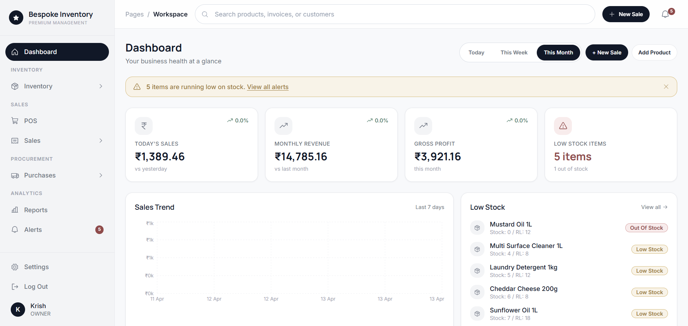
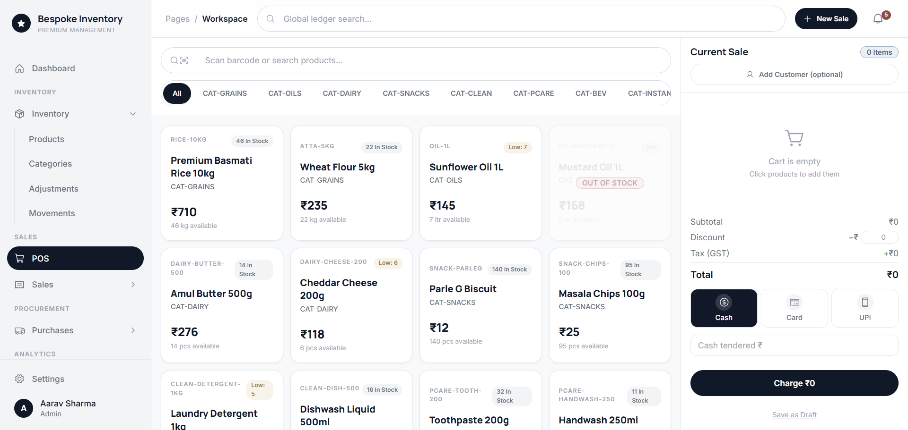
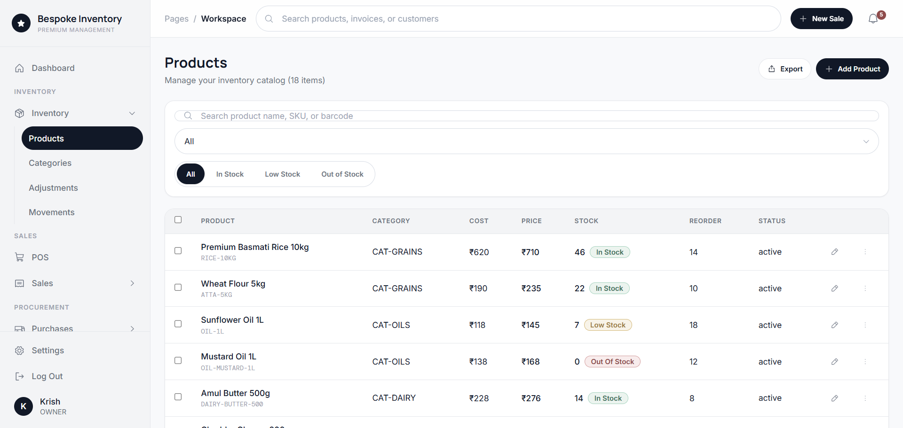

# Bespoke Inventory Management System

Production-style full stack inventory application with POS, sales analytics, stock movement tracking, and multi-module operational workflows.

The repository is organized for recruiter-friendly review with a React + TypeScript frontend and Node.js + Express + MongoDB backend.

## Table of Contents
1. Project Overview
2. Key Features
3. Tech Stack
4. Architecture
5. Repository Structure
6. Quick Start Guide
7. Environment Variables
8. Available Scripts
9. API Surface
10. Quality and Tooling
11. Screenshots and Demo
12. GitHub Repository Metadata
13. Troubleshooting
14. Known Limitations
15. Roadmap
16. Security Notes

## Project Overview

Bespoke Inventory is designed to model real business operations for retail inventory management:
- Product catalog management
- Point of Sale transaction flow
- Stock adjustments with reason tracking
- Inventory movement ledger
- Sales history and reporting
- Supplier and purchase planning support
- Alerting for low stock conditions

This project can be used as:
- A strong resume portfolio project
- A learning reference for modular Node API design
- A base template for internal inventory tooling

## Key Features

- JWT-based authentication with refresh-token flow
- Tenant-style store scope separation at backend level
- Product CRUD with status and stock intelligence
- POS cart and payment flow with sales write operations
- Real-time low-stock visibility across screens
- Dashboard and reporting views with chart visualizations
- Robust query error handling with retry and re-login flows
- Lint-clean frontend and backend workflow

## Tech Stack

Frontend:
- React 19
- TypeScript
- Vite
- React Router
- TanStack Query
- Recharts
- Tailwind CSS 4

Backend:
- Node.js
- Express
- MongoDB + Mongoose
- JWT
- Zod
- Pino logging

Tooling:
- ESLint (flat config)
- TypeScript build validation

## Architecture

Frontend architecture:
- Feature pages under frontend/src/pages
- Shared layout under frontend/src/components/layout
- API client and session helpers under frontend/src/services

Backend architecture:
- Modular route-service-repository design under backend/src/modules
- Shared middleware and utilities under backend/src/common
- Script-driven data/bootstrap tools under backend/src/scripts

Communication model:
- Frontend consumes backend REST API at /api/v1
- Authenticated requests use bearer tokens

## Repository Structure

- backend: API server, data scripts, and backend config
- frontend: SPA client and UI source
- static html and blueprint files in root: design references and supporting docs

Primary folders:
- backend/src/modules
- backend/src/scripts
- frontend/src/pages
- frontend/src/components
- frontend/src/services

## Quick Start Guide

Prerequisites:
- Node.js 18+
- npm 9+
- MongoDB running locally on port 27017

Step 1: Start backend

In terminal 1:
cd backend
copy .env.example .env
npm install
npm run dev

Step 2: Optional user/data setup commands

In terminal 2 (optional):
cd backend
npm run user:permanent
npm run data:assign-permanent
npm run user:reset-and-adopt

Step 3: Start frontend

In terminal 3:
cd frontend
copy .env.example .env
npm install
npm run dev

Frontend default URL:
- http://localhost:5173

Backend default URL:
- http://localhost:5001

Frontend API base used by default:
- http://localhost:5001/api/v1

## Environment Variables

Frontend:
- VITE_API_BASE_URL

Backend important variables:
- NODE_ENV
- PORT
- MONGO_URI
- MONGO_AUTO_MEMORY_FALLBACK
- DEV_BOOTSTRAP_DEMO_ADMIN
- DEV_DEMO_ADMIN_NAME
- DEV_DEMO_ADMIN_EMAIL
- DEV_DEMO_ADMIN_PASSWORD
- DEV_DEMO_STORE_ID
- JWT_ACCESS_SECRET
- JWT_REFRESH_SECRET
- JWT_ACCESS_EXPIRES
- JWT_REFRESH_EXPIRES
- CORS_ORIGIN
- LOG_LEVEL

Use only .env.example as template and never commit real .env files.

## Available Scripts

Backend scripts:
- npm run dev
- npm run start
- npm run db:init
- npm run user:permanent
- npm run user:reset-and-adopt
- npm run data:assign-permanent
- npm run lint

Frontend scripts:
- npm run dev
- npm run build
- npm run preview
- npm run lint

## API Surface

Authentication:
- POST /api/v1/auth/register
- POST /api/v1/auth/login
- POST /api/v1/auth/refresh-token
- POST /api/v1/auth/logout

Products:
- GET /api/v1/products
- GET /api/v1/products/:id
- POST /api/v1/products
- PATCH /api/v1/products/:id
- DELETE /api/v1/products/:id

Inventory:
- GET /api/v1/inventory/low-stock
- GET /api/v1/inventory/movements
- POST /api/v1/inventory/adjustments

Sales:
- GET /api/v1/sales
- GET /api/v1/sales/:id
- POST /api/v1/sales

Reports:
- GET /api/v1/reports/dashboard

Health:
- GET /health

## Quality and Tooling

Run quality checks:

Frontend:
cd frontend
npm run lint
npm run build

Backend:
cd backend
npm run lint

Current baseline:
- Frontend lint: passing
- Backend lint: passing
- Frontend build: passing

## Screenshots and Demo

Add screenshots to the screenshots folder using the file names below.

Recommended screenshot set:

Optional demo section:
- Live Demo: add deployed frontend URL
- API Docs: add Postman collection or Swagger link

## GitHub Repository Metadata

Use these values in your GitHub repository settings.

Repository name:
- bespoke-inventory-management-system

Short description:
- Full stack inventory management and POS system with React, TypeScript, Node.js, Express, and MongoDB.

About tagline:
- Production-style inventory and POS application with analytics, stock operations, and robust API-driven workflows.

Suggested topics:
- react
- typescript
- vite
- nodejs
- express
- mongodb
- full-stack
- inventory-management
- pos-system
- tanstack-query
- tailwindcss
- recharts

## Troubleshooting

Issue: data not visible on UI
- Ensure backend is running on configured port
- Verify MongoDB is running on 127.0.0.1:27017
- Re-login if token/session expired
- Run data alignment scripts if store scope differs

Issue: frontend cannot call API
- Check frontend .env VITE_API_BASE_URL
- Check backend CORS_ORIGIN and PORT

Issue: empty product list in POS
- Ensure backend has product records for the logged-in store scope
- Confirm authenticated user has data in same store scope

## Known Limitations

- Purchase endpoints are scaffolded and may return 501 for non-implemented flows
- Repository includes static reference assets not wired to runtime app

## Roadmap

- Complete purchase workflow backend implementation
- Add unit/integration tests for critical modules
- Add CI pipeline for lint and build validation
- Add deployed demo link and screenshots section

## Security Notes

- Never commit real secrets or environment files
- Rotate credentials if secrets were ever exposed
- Keep JWT secrets and database credentials private
